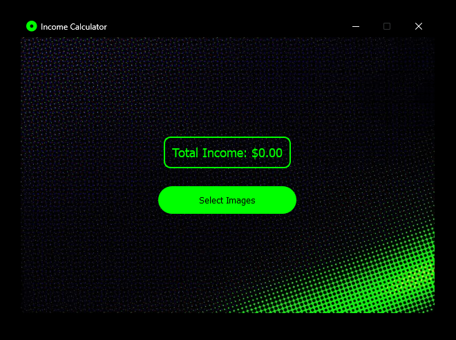

# Income Calculator

This is a simple desktop application built with PySide6 that helps users calculate their total income by processing images containing salary information. The application utilizes EasyOCR for text extraction from images.

## Features
- **Image Selection**: Users can select one or more images containing salary information.
- **Text Extraction**: The application extracts text from the selected images using EasyOCR.
- **Income Calculation**: Based on the extracted text, the application calculates the total income.
- **User-Friendly Interface**: The application provides an intuitive interface for easy interaction.

## Installation
1. Clone the repository:
```commandline
git clone https://github.com/xkevan19/income-calculator.git
```
2. Install the required dependencies:
```commandline
pip install -r requirements.txt
```
3. Run the application via command line/terminal:
```commandline
python main.py
```
4. Run the application via executable file:
 - Download the [zip file](https://mega.nz/file/9PcFzRTa#Dx1TrvkkTO7E1JA1n8R5EUUlmiPYUPGhs01j9N2P7ug) 
 - Extract to your system
 - Navigate to main.exe
   - **ocr-with-ui > dist > main > main.exe**

## Usage
1. Launch the application by running ```main.py``` or clicking main.exe.
2. Click on the "Select Images" button to choose one or more images containing salary information.
3. The application will process the selected images and display the total income extracted from them.

## Screenshots

### Used For Tests
Feel free to use these images for your testing as well 🙂

[Screenshot of Income Calculator main screen](images/testone-PASSED-unobstructedcolorscsheme.png)

[Screenshot of a PASSED test that was not obstructed by colour scheme](images/testtwo-PASSED-unobstructedcolorscsheme.png)

[Screenshot of a PASSED skeleton test](images/testthree-PASSED-skeleton.png)

[Screenshot of a PASSED test that was not obstructed by colour scheme](images/testfour-PASSED-unobstructedcolorscsheme.png)

[Screenshot of a PASSED test at the smallest, readable font size to the OCR](images/testfive-PASSED-10pxfsize.png)

[Screenshot of a FAILED test due to font size and multiple figures](images/testsix-FAILED-multplefigures.png)

[Screenshot of a FAILED test due to small font size](images/testseven-FAILED-fontsizing.png)

[Screenshot of a PASSED test with a structure change](images/testeight-PASSED.png)

[Screenshot of a PARTIAL where no logic for additional bonus/commissions were implemented](images/testnine-PARTIAL-noaddedlogicforbonuses.png)

## Contributing
Contributions are welcome! If you find any issues or have suggestions for improvements, please open an issue or submit a pull request.

## Credits
- [Computer vision engineer](https://github.com/computervisioneng/text-detection-python-easyocr) - Where the concept was derived from.
- [EasyOCR](https://github.com/JaidedAI/EasyOCR) - For text extraction from images.
- [PySide6](https://pypi.org/project/PySide6/) - For building the GUI.
- [OpenCV](https://opencv.org/) - For image processing.

## Developer
- [Github](https://github.com/xkevan19)
- [LinkedIn](https://www.linkedin.com/in/kevansuchit/)

With over 2 years of industry experience, I've refined the full cycle of web application development, from planning to deployment. Proficient in SQL, web development, data analytics, UI/UX design, and product management, I deliver tailored solutions that blend technical expertise with client-centricity. I excel in pre-sale engineering and customer service, driving innovation and inspiring others in the evolving IT landscape.